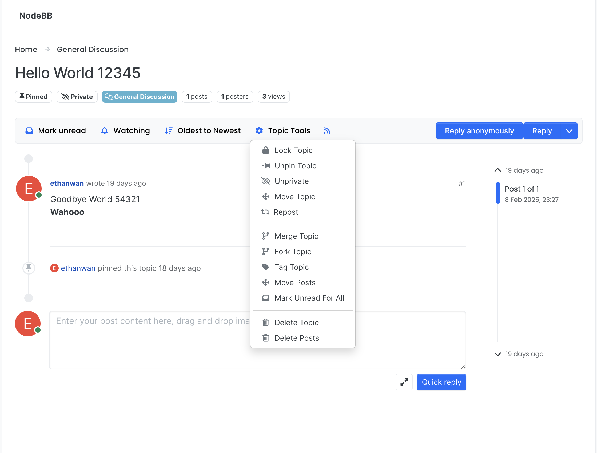
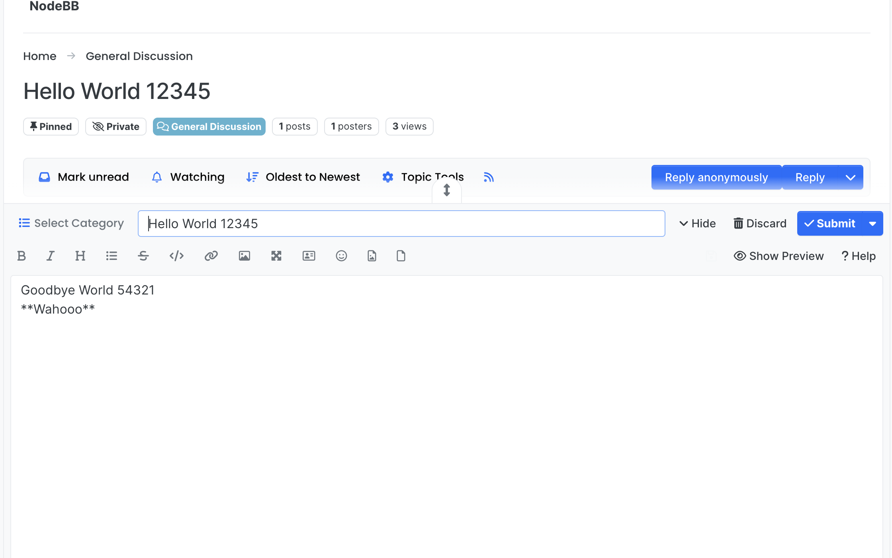
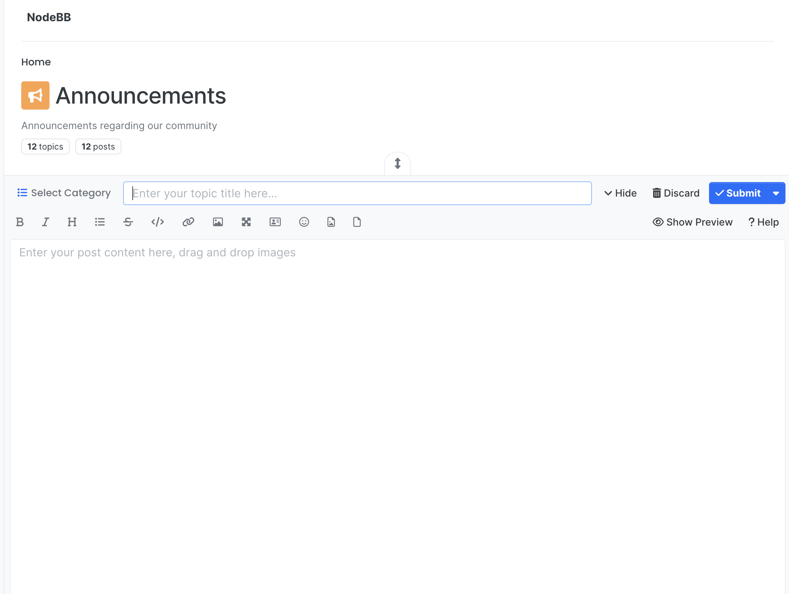
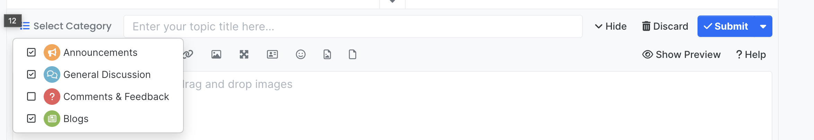
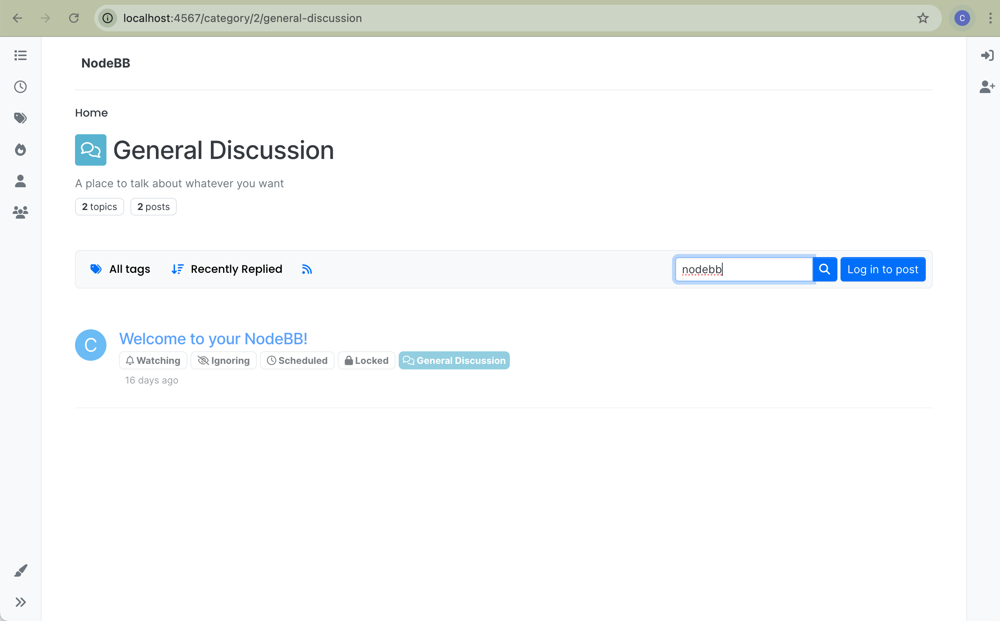
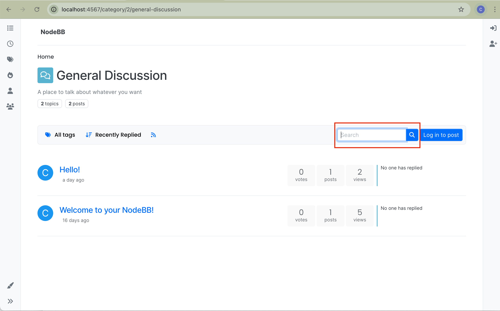
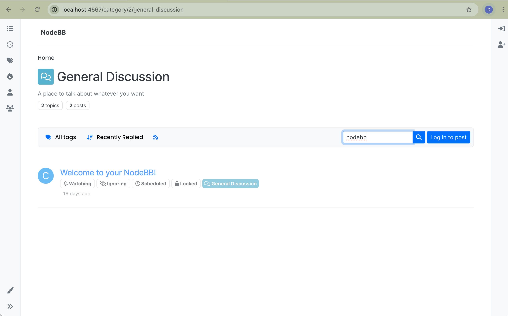

# User Guide
In this guide we will detail the features we added and how to user-test them

## Repost to other categories
This feature allows users to repost a topic to a different category, as demonstrated below:
1. Open a topic and open the `Topic Tools` menu and select `Repost`:
    
2. The Repost modal will show up with a copy of your post, which you can then select new categories to post to. 
    

### Testing
- There are no additional tests for this feature, since it was built into another feature that already had test coverage. 

## Posting to multiple categories
1. Open up the new topic modal, by creating a new topic:
    
2. Use the category selector to select the categories that you want to post to:
    

### Testing
- There are no additional tests for this feature, since it was built into another feature that already had test coverage.

## Search for post topics using specific keywords
This feature allows users to enter a search keyword and filter the post list to only include post topics containing the keyword.
1. Navigate to any page that contains a list of posts (e.g. a category such as 'General Discussion' or a page such as 'Recent'):
    
2. Enter characters into the search bar near the top (highlighted in red):
    
3. The post list will update to only contain posts topics that contain the search term.
    

### Testing
Automated tests for this feature are located in the test/topics/search.js file. These test the Topics.searchByKeyword function that filters topics according to the keyword and is used by the backend API.
To test this feature, run:
```
npm run test
```
To add a test,
1. Provide a query object with the 'keyword' and 'initTopics' (list of topics to search from ) properties.
2. Pass the query into Topics.searchByKeyword() and ensure the resulting array matches the expected behavior.

These tests cover scenarios including:
- Listing all post with topics that contain the keyword
- Showing no posts if none of their topics match the keyword
- Showing no posts if there are none to search from despite there being a keyword
- Listing all post topics if the the keyword is empty
- Ensuring search is case-insensitive
- Verifying post topics with partial matches to the keyword are shown
These tests are sufficient to test the feature and ensure the acceptance criteria is met because it verifies that the function correctly filters topics that contain the keyword, handles edge cases, is case-insensitive, and overall behaves as expected no matter the query.
